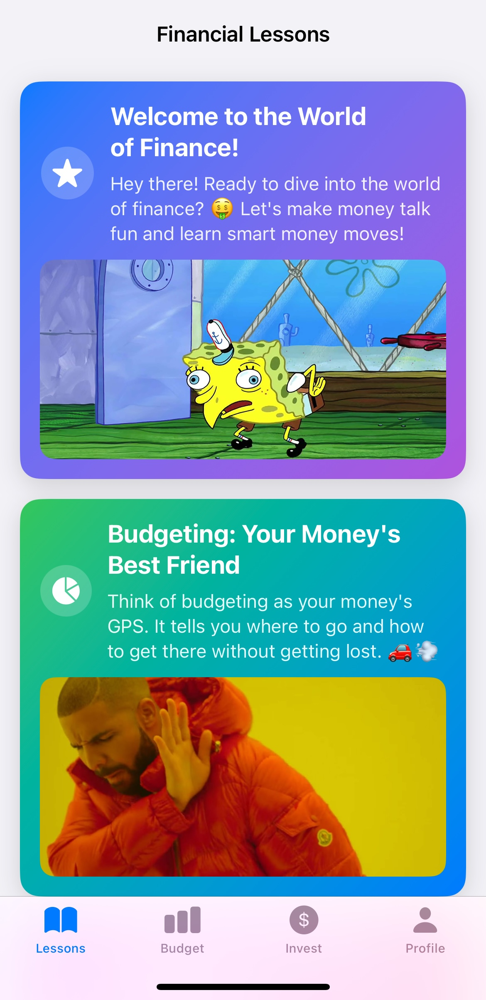

# 🌟 Finance for Teens

Finance for Teens is an educational app designed to empower teenagers with essential financial literacy skills. Through interactive lessons, quizzes, and practical scenarios, users can learn about budgeting, saving, investing, and more.

## 🚀 Features

### 📚 Lessons
- **Engaging Content**: Explore various financial topics with detailed explanations, key principles, dos and don'ts, and interesting facts.
- **Visual Learning**: Each lesson is accompanied by relatable memes and images to make learning fun.

### 💰 Budget Scenarios
- **Interactive Practice**: Engage with real-life budgeting scenarios to apply what you've learned.
- **Goal Setting**: Learn to set and achieve financial goals through practical exercises.

### 📈 Investment Insights
- **Comprehensive Topics**: Understand the basics of investing, including types of investments, risk and reward, and the power of compounding.
- **Quizzes**: Test your knowledge with quizzes designed to reinforce learning.

### 🏆 Profile Tracking
- **Progress Monitoring**: Track your lessons completed, quiz scores, and savings progress.
- **Achievements**: Earn badges for reaching milestones and mastering financial concepts.

### 🔐 Authentication
- **Secure Sign-In**: Sign in or sign up using email, Google, or Apple for a seamless experience.
- **User Data Management**: Securely manage user data and preferences.

## 📸 Screenshots

### Lessons

*Overview of financial lessons with engaging content.*


*Detailed view of a specific lesson with key principles.*

### Budget Scenarios

*Interactive budgeting scenarios to practice financial planning.*


*Detailed view of a budgeting scenario with key points.*

### Investment Insights

*Overview of investment topics with engaging content.*


*Quiz to test knowledge on investment topics.*

### Profile Tracking

*Overview of user profile with progress tracking.*


*View of earned badges and achievements.*

## 🛠 Installation

1. **Clone the Repository**:
   ```bash
   git clone https://github.com/yourusername/finance-for-teens.git
   cd finance-for-teens
   ```

2. **Open in Xcode**:
   - Open `Finance for Teens.xcodeproj` in Xcode.

3. **Install Dependencies**:
   - Ensure Firebase and Google Sign-In are set up correctly.

4. **Run the App**:
   - Select a simulator or device and click the Run button in Xcode.

## ⚙️ Configuration

- **Firebase**: Add your `GoogleService-Info.plist` to the project.
- **Google Sign-In**: Configure your `Info.plist` with the necessary URL schemes.
- **Apple Sign-In**: Enable "Sign In with Apple" in your app's capabilities.

## 📖 Usage

- **Navigate Lessons**: Access a variety of financial topics and learn at your own pace.
- **Practice Budgeting**: Use interactive scenarios to hone your budgeting skills.
- **Explore Investments**: Dive into investment topics and challenge yourself with quizzes.
- **Track Your Progress**: Monitor your achievements and update your savings goals in the profile section.

## 🛠 Languages and Packages Used

- **Languages**: Swift, SwiftUI
- **Packages**:
  - Firebase
  - Google Sign-In
  - AuthenticationServices (for Apple Sign-In)

## 🤝 Contributing

Contributions are welcome! Please fork the repository and submit a pull request.

## 📜 License

This project is licensed under the MIT License.

## 📧 Contact

For questions or feedback, please contact [tanishqprabhu20@gmail.com].
